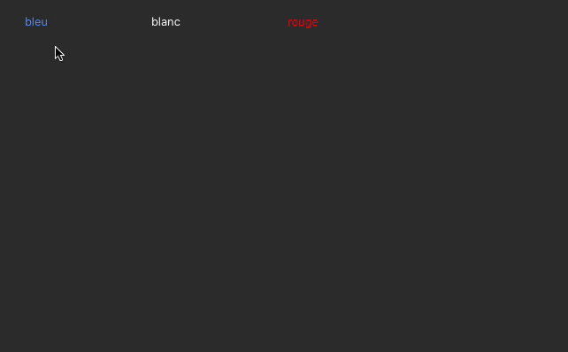

# CopyPasteStyleFormMacro

Examples to copy some style keys from one selected objet to another.

## Macro classes

List of macro defined here [Project/Sources/FormMacros.json](Project/Sources/FormMacros.json)

#### Abtract class 

* [FormMacro](Project/Sources/Classes/FormMacro.4dm) allow to share some functions between macro classes
* [StyleMacro](Project/Sources/Classes/StyleMacro.4dm) allow to share some functions about style.

### CopyStyle

[CopyStyle](Project/Sources/Classes/CopyStyle.4dm) copy selected object style into pasteboard using JSON format.

Not all style keys are copyed, a list of keys is [here](https://github.com/mesopelagique/Example-FormMacro-CopyPasteStyle/blob/master/Project/Sources/Classes/StyleMacro.4dm#L4) in code. More could be added, see todo (like background color...)

#### to fix see todo

Because some style are not defined in object by applying `Null` to an object will failed, [`defaultValue`](https://github.com/mesopelagique/Example-FormMacro-CopyPasteStyle/blob/master/Project/Sources/Classes/StyleMacro.4dm#L23) function provide default value for some object keys.

> - `fontSize` 0 is for Automatic
> - no `borderStyle` is "none"

### PasteStyle

[PasteStyle](Project/Sources/Classes/PasteStyle.4dm) get the style from pasteboard and apply to the selected element

### SaveStyle

[SaveStyle](Project/Sources/Classes/SaveStyle.4dm), select an object and provide a name to the style. It will saved in a share file (`Folder:C1567(fk user preferences folder).file("styleMacro.json")`) ad you could use later with next macro.

### LoadStyle

[LoadStyle](Project/Sources/Classes/LoadStyle.4dm): select an object and launch the macro. A menu will be shown to select one of the saved style to apply.

## TODO

- Apply the style to a list of selected elements (easy, you could PR if you implement it, my other macro do it)
- More style keys
- Instead of settings null, unset when pasting style if not defined
